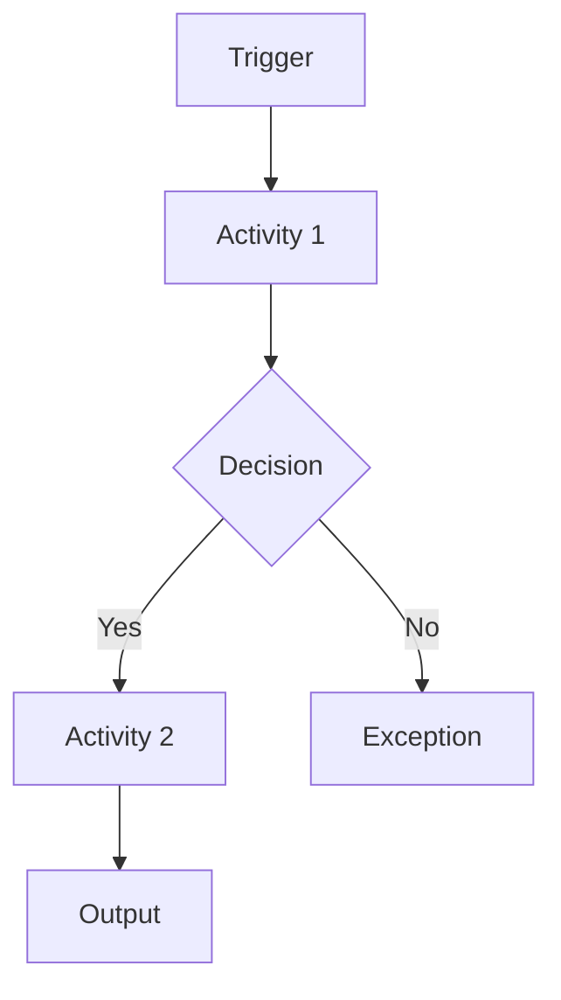

# ISMS Process Description Template

| Field | Content |
|---|---|
| Process name |  |
| Process ID |  |
| Process owner |  |
| Purpose |  |
| Trigger |  |
| Scope |  |
| Inputs |  |
| Outputs |  |
| Participants |  |
| Interfaces |  |
| Related risks |  |
| Related controls |  |
| Evidence |  |
| KPIs / KRIs / KCIs |  |
| Review frequency |  |

## Process flow

## Activities

| Step | Activity | Responsible | Evidence |
|---|---|---|---|
| 1 |  |  |  |
