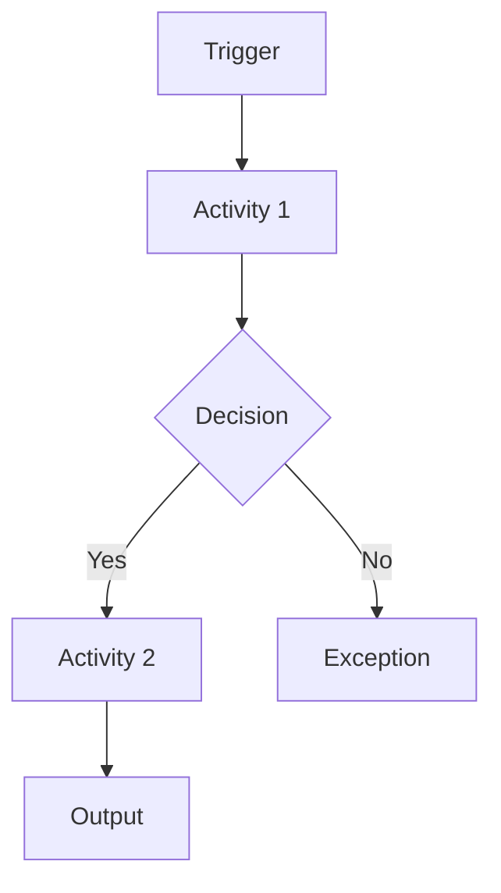

# information security management system (ISMS) Process Description Template

| Field | Content |
|---|---|
| Process name |  |
| Process ID |  |
| Process owner |  |
| Purpose |  |
| Trigger |  |
| Scope |  |
| Inputs |  |
| Outputs |  |
| Participants |  |
| Interfaces |  |
| Related risks |  |
| Related controls |  |
| Evidence |  |
| KPIs / KRIs / KCIs |  |
| Review frequency |  |

## Process flow

## Activities

| Step | Activity | Responsible | Evidence |
|---|---|---|---|
| 1 |  |  |  |

## Usage guidance

Use this template to document **ISMS Process Description**. The owner defines its trigger and scope, uses authoritative sources, routes required approval, and tracks open items. Adapt the fields; this is guidance, not required ISO wording.

## Evidence to retain

Retain the approved record, source evidence, approval history, exceptions, and follow-up actions under the organization's retention and protection rules.

## Practical example

For one in-scope service, the owner completes the **ISMS Process Description** record, links authoritative evidence, obtains review, and tracks rejected or incomplete items to closure.

## ISO requirement, implementation guidance, and best practice

This exact template is not an ISO requirement; it is guidance for recording **ISMS Process Description** consistently. Controlled values, named owners, timestamps, approvals, and authoritative evidence improve assurance.

## Related controls, clauses, templates, and checklists

Project indexes: [clauses](../03-iso27001/clauses-4-to-10.md) · [controls](../06-annex-a/index.md) · [templates](index.md) · [checklists](../11-checklists/index.md) · [abbreviations](../15-reference/abbreviations.md).
