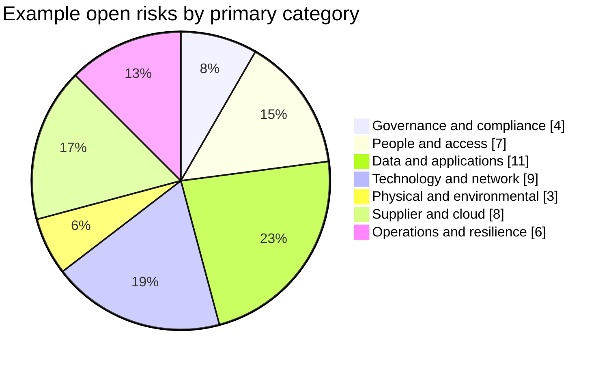

# Risk Register Template

> The summary-table and chart pattern are based in part on the risk-register workbook in the [ISO 27001:2022 Toolkit](https://github.com/PehanIn/ISO-27001-2022-Toolkit), copyright (c) 2024 Pehan Gunasekara, MIT License. Demonstration percentages from the source were not reused.

| Risk ID | Risk scenario | Asset / process | Risk owner | Existing controls | Impact | Likelihood | Inherent risk | Treatment option | Treatment actions | Residual risk | Acceptance status | Review date |
|---|---|---|---|---|---:|---:|---:|---|---|---:|---|---|
| R-001 |  |  |  |  |  |  |  | Reduce / Avoid / Transfer / Accept |  |  | Pending / Accepted / Not accepted |  |

## Usage guidance

The risk register should be linked to:

- asset inventory
- risk assessment methodology
- treatment plan
- Statement of Applicability
- risk acceptance records
- management review

## Risk-category summary

Use organization-defined categories only when they improve ownership, aggregation, or decisions. A risk may span several categories; define a consistent primary-category rule if each row must be counted once.

| Primary category | Open risks | Above tolerance | Overdue treatment | Accepted residual risk | Trend |
|---|---:|---:|---:|---:|---|
| Governance and compliance |  |  |  |  | Improving / Stable / Worsening |
| People and access |  |  |  |  |  |
| Data and applications |  |  |  |  |  |
| Technology and network |  |  |  |  |  |
| Physical and environmental |  |  |  |  |  |
| Supplier and cloud |  |  |  |  |  |
| Operations and resilience |  |  |  |  |  |

### Example risk-distribution chart

The following counts are illustrative only. Replace them with a reproducible summary of the approved risk register. A distribution chart shows composition, not risk severity; present above-tolerance and overdue risks separately.

## Evidence to retain

Retain the approved record, source evidence, approval history, exceptions, and follow-up actions under the organization's retention and protection rules.

## Practical example

For one in-scope service, the owner completes the **Risk Register** record, links authoritative evidence, obtains review, and tracks rejected or incomplete items to closure.

## ISO requirement, implementation guidance, and best practice

This exact template is not an ISO requirement; it is guidance for recording **Risk Register** consistently. Controlled values, named owners, timestamps, approvals, and authoritative evidence improve assurance.

## Related controls, clauses, templates, and checklists

Project indexes: [clauses](../03-iso27001/clauses-4-to-10.md) · [controls](../06-annex-a/index.md) · [templates](index.md) · [checklists](../11-checklists/index.md) · [abbreviations](../15-reference/abbreviations.md).
