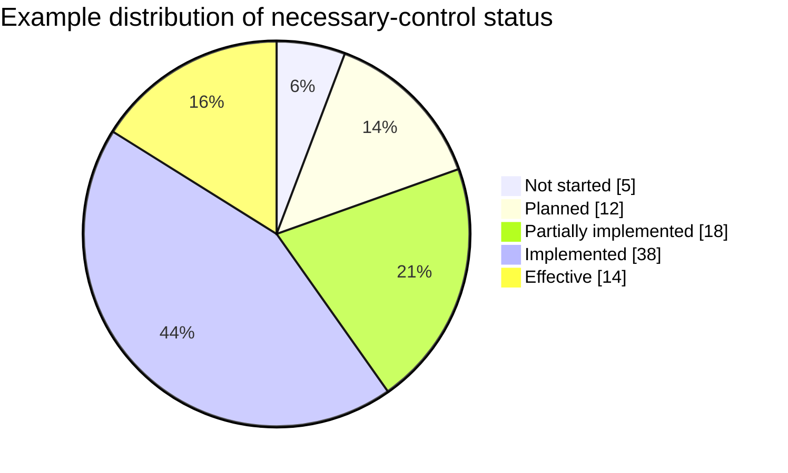

# Statement of Applicability Template

> The status summary and chart pattern are based in part on the SoA workbook in the [ISO 27001:2022 Toolkit](https://github.com/PehanIn/ISO-27001-2022-Toolkit), copyright (c) 2024 Pehan Gunasekara, MIT License. Status definitions and reporting rules have been simplified and corrected for this project.

| Field | Content |
|---|---|
| Organization | [Organization name] |
| information security management system (ISMS) scope | [Scope reference] |
| Version | [Version] |
| Owner | [ISMS manager] |
| Approved by | [Top management / risk committee] |
| Approval date | [Date] |

## 1. Purpose

The Statement of Applicability records all necessary controls, including organization-defined controls, their inclusion rationale and implementation status, and the justification for excluding Annex A reference controls. Comparing the necessary-control set with Annex A is a completeness check; Annex A is not the upper limit of the control set.

## 2. Necessary controls and Annex A comparison

| Control ID | Control name | Source | Necessary? | Inclusion / exclusion rationale | Implemented? | Local status | Control owner | Related risks / obligations | Evidence / document reference |
|---|---|---|---|---|---|---|---|---|---|
| ORG-001 | Organization-defined control | Risk / law / regulation / contract / other framework | Yes |  | Yes / No | Planned / Partial / Implemented |  |  |  |
| A.5.1 | Policies for information security | Annex A | Yes / No |  | Yes / No / — | Planned / Partial / Implemented / — |  |  |  |
| A.5.2 | Information security roles and responsibilities | Annex A | Yes / No |  | Yes / No / — | Planned / Partial / Implemented / — |  |  |  |
| A.5.3 | Segregation of duties | Annex A | Yes / No |  | Yes / No / — | Planned / Partial / Implemented / — |  |  |  |
| A.5.4 | Management responsibilities | Annex A | Yes / No |  | Yes / No / — | Planned / Partial / Implemented / — |  |  |  |
| A.5.5 | Contact with authorities | Annex A | Yes / No |  | Yes / No / — | Planned / Partial / Implemented / — |  |  |  |
| A.5.6 | Contact with special interest groups | Annex A | Yes / No |  | Yes / No / — | Planned / Partial / Implemented / — |  |  |  |
| A.5.7 | Threat intelligence | Annex A | Yes / No |  | Yes / No / — | Planned / Partial / Implemented / — |  |  |  |
| A.5.8 | Information security in project management | Annex A | Yes / No |  | Yes / No / — | Planned / Partial / Implemented / — |  |  |  |
| A.5.9 | Inventory of information and other associated assets | Annex A | Yes / No |  | Yes / No / — | Planned / Partial / Implemented / — |  |  |  |
| A.5.10 | Acceptable use of information and other associated assets | Annex A | Yes / No |  | Yes / No / — | Planned / Partial / Implemented / — |  |  |  |
| A.5.11 | Return of assets | Annex A | Yes / No |  | Yes / No / — | Planned / Partial / Implemented / — |  |  |  |
| A.5.12 | Classification of information | Annex A | Yes / No |  | Yes / No / — | Planned / Partial / Implemented / — |  |  |  |
| A.5.13 | Labelling of information | Annex A | Yes / No |  | Yes / No / — | Planned / Partial / Implemented / — |  |  |  |
| A.5.14 | Information transfer | Annex A | Yes / No |  | Yes / No / — | Planned / Partial / Implemented / — |  |  |  |
| A.5.15 | Access control | Annex A | Yes / No |  | Yes / No / — | Planned / Partial / Implemented / — |  |  |  |
| A.5.16 | Identity management | Annex A | Yes / No |  | Yes / No / — | Planned / Partial / Implemented / — |  |  |  |
| A.5.17 | Authentication information | Annex A | Yes / No |  | Yes / No / — | Planned / Partial / Implemented / — |  |  |  |
| A.5.18 | Access rights | Annex A | Yes / No |  | Yes / No / — | Planned / Partial / Implemented / — |  |  |  |
| A.5.19 | Information security in supplier relationships | Annex A | Yes / No |  | Yes / No / — | Planned / Partial / Implemented / — |  |  |  |
| A.5.20 | Information security in supplier agreements | Annex A | Yes / No |  | Yes / No / — | Planned / Partial / Implemented / — |  |  |  |
| A.5.21 | information and communication technology (ICT) supply chain security | Annex A | Yes / No |  | Yes / No / — | Planned / Partial / Implemented / — |  |  |  |
| A.5.22 | Monitoring, review and change management of supplier services | Annex A | Yes / No |  | Yes / No / — | Planned / Partial / Implemented / — |  |  |  |
| A.5.23 | Information security for use of cloud services | Annex A | Yes / No |  | Yes / No / — | Planned / Partial / Implemented / — |  |  |  |
| A.5.24 | Incident management planning and preparation | Annex A | Yes / No |  | Yes / No / — | Planned / Partial / Implemented / — |  |  |  |
| A.5.25 | Assessment and decision on information security events | Annex A | Yes / No |  | Yes / No / — | Planned / Partial / Implemented / — |  |  |  |
| A.5.26 | Response to information security incidents | Annex A | Yes / No |  | Yes / No / — | Planned / Partial / Implemented / — |  |  |  |
| A.5.27 | Learning from information security incidents | Annex A | Yes / No |  | Yes / No / — | Planned / Partial / Implemented / — |  |  |  |
| A.5.28 | Collection of evidence | Annex A | Yes / No |  | Yes / No / — | Planned / Partial / Implemented / — |  |  |  |
| A.5.29 | Information security during disruption | Annex A | Yes / No |  | Yes / No / — | Planned / Partial / Implemented / — |  |  |  |
| A.5.30 | ICT readiness for business continuity | Annex A | Yes / No |  | Yes / No / — | Planned / Partial / Implemented / — |  |  |  |
| A.5.31 | Legal, statutory, regulatory and contractual requirements | Annex A | Yes / No |  | Yes / No / — | Planned / Partial / Implemented / — |  |  |  |
| A.5.32 | Intellectual property rights | Annex A | Yes / No |  | Yes / No / — | Planned / Partial / Implemented / — |  |  |  |
| A.5.33 | Protection of records | Annex A | Yes / No |  | Yes / No / — | Planned / Partial / Implemented / — |  |  |  |
| A.5.34 | Privacy and protection of personally identifiable information (PII) | Annex A | Yes / No |  | Yes / No / — | Planned / Partial / Implemented / — |  |  |  |
| A.5.35 | Independent review of information security | Annex A | Yes / No |  | Yes / No / — | Planned / Partial / Implemented / — |  |  |  |
| A.5.36 | Compliance with policies, rules and standards | Annex A | Yes / No |  | Yes / No / — | Planned / Partial / Implemented / — |  |  |  |
| A.5.37 | Documented operating procedures | Annex A | Yes / No |  | Yes / No / — | Planned / Partial / Implemented / — |  |  |  |
| A.6.1 | Screening | Annex A | Yes / No |  | Yes / No / — | Planned / Partial / Implemented / — |  |  |  |
| A.6.2 | Terms and conditions of employment | Annex A | Yes / No |  | Yes / No / — | Planned / Partial / Implemented / — |  |  |  |
| A.6.3 | Information security awareness, education and training | Annex A | Yes / No |  | Yes / No / — | Planned / Partial / Implemented / — |  |  |  |
| A.6.4 | Disciplinary process | Annex A | Yes / No |  | Yes / No / — | Planned / Partial / Implemented / — |  |  |  |
| A.6.5 | Responsibilities after termination or change of employment | Annex A | Yes / No |  | Yes / No / — | Planned / Partial / Implemented / — |  |  |  |
| A.6.6 | Confidentiality or non-disclosure agreements | Annex A | Yes / No |  | Yes / No / — | Planned / Partial / Implemented / — |  |  |  |
| A.6.7 | Remote working | Annex A | Yes / No |  | Yes / No / — | Planned / Partial / Implemented / — |  |  |  |
| A.6.8 | Information security event reporting | Annex A | Yes / No |  | Yes / No / — | Planned / Partial / Implemented / — |  |  |  |
| A.7.1 | Physical security perimeters | Annex A | Yes / No |  | Yes / No / — | Planned / Partial / Implemented / — |  |  |  |
| A.7.2 | Physical entry | Annex A | Yes / No |  | Yes / No / — | Planned / Partial / Implemented / — |  |  |  |
| A.7.3 | Securing offices, rooms and facilities | Annex A | Yes / No |  | Yes / No / — | Planned / Partial / Implemented / — |  |  |  |
| A.7.4 | Physical security monitoring | Annex A | Yes / No |  | Yes / No / — | Planned / Partial / Implemented / — |  |  |  |
| A.7.5 | Protecting against physical and environmental threats | Annex A | Yes / No |  | Yes / No / — | Planned / Partial / Implemented / — |  |  |  |
| A.7.6 | Working in secure areas | Annex A | Yes / No |  | Yes / No / — | Planned / Partial / Implemented / — |  |  |  |
| A.7.7 | Clear desk and clear screen | Annex A | Yes / No |  | Yes / No / — | Planned / Partial / Implemented / — |  |  |  |
| A.7.8 | Equipment siting and protection | Annex A | Yes / No |  | Yes / No / — | Planned / Partial / Implemented / — |  |  |  |
| A.7.9 | Security of assets off-premises | Annex A | Yes / No |  | Yes / No / — | Planned / Partial / Implemented / — |  |  |  |
| A.7.10 | Storage media | Annex A | Yes / No |  | Yes / No / — | Planned / Partial / Implemented / — |  |  |  |
| A.7.11 | Supporting utilities | Annex A | Yes / No |  | Yes / No / — | Planned / Partial / Implemented / — |  |  |  |
| A.7.12 | Cabling security | Annex A | Yes / No |  | Yes / No / — | Planned / Partial / Implemented / — |  |  |  |
| A.7.13 | Equipment maintenance | Annex A | Yes / No |  | Yes / No / — | Planned / Partial / Implemented / — |  |  |  |
| A.7.14 | Secure disposal or re-use of equipment | Annex A | Yes / No |  | Yes / No / — | Planned / Partial / Implemented / — |  |  |  |
| A.8.1 | User endpoint devices | Annex A | Yes / No |  | Yes / No / — | Planned / Partial / Implemented / — |  |  |  |
| A.8.2 | Privileged access rights | Annex A | Yes / No |  | Yes / No / — | Planned / Partial / Implemented / — |  |  |  |
| A.8.3 | Information access restriction | Annex A | Yes / No |  | Yes / No / — | Planned / Partial / Implemented / — |  |  |  |
| A.8.4 | Access to source code | Annex A | Yes / No |  | Yes / No / — | Planned / Partial / Implemented / — |  |  |  |
| A.8.5 | Secure authentication | Annex A | Yes / No |  | Yes / No / — | Planned / Partial / Implemented / — |  |  |  |
| A.8.6 | Capacity management | Annex A | Yes / No |  | Yes / No / — | Planned / Partial / Implemented / — |  |  |  |
| A.8.7 | Protection against malware | Annex A | Yes / No |  | Yes / No / — | Planned / Partial / Implemented / — |  |  |  |
| A.8.8 | Management of technical vulnerabilities | Annex A | Yes / No |  | Yes / No / — | Planned / Partial / Implemented / — |  |  |  |
| A.8.9 | Configuration management | Annex A | Yes / No |  | Yes / No / — | Planned / Partial / Implemented / — |  |  |  |
| A.8.10 | Information deletion | Annex A | Yes / No |  | Yes / No / — | Planned / Partial / Implemented / — |  |  |  |
| A.8.11 | Data masking | Annex A | Yes / No |  | Yes / No / — | Planned / Partial / Implemented / — |  |  |  |
| A.8.12 | Data leakage prevention | Annex A | Yes / No |  | Yes / No / — | Planned / Partial / Implemented / — |  |  |  |
| A.8.13 | Information backup | Annex A | Yes / No |  | Yes / No / — | Planned / Partial / Implemented / — |  |  |  |
| A.8.14 | Redundancy of information processing facilities | Annex A | Yes / No |  | Yes / No / — | Planned / Partial / Implemented / — |  |  |  |
| A.8.15 | Logging | Annex A | Yes / No |  | Yes / No / — | Planned / Partial / Implemented / — |  |  |  |
| A.8.16 | Monitoring activities | Annex A | Yes / No |  | Yes / No / — | Planned / Partial / Implemented / — |  |  |  |
| A.8.17 | Clock synchronization | Annex A | Yes / No |  | Yes / No / — | Planned / Partial / Implemented / — |  |  |  |
| A.8.18 | Use of privileged utility programs | Annex A | Yes / No |  | Yes / No / — | Planned / Partial / Implemented / — |  |  |  |
| A.8.19 | Installation of software on operational systems | Annex A | Yes / No |  | Yes / No / — | Planned / Partial / Implemented / — |  |  |  |
| A.8.20 | Networks security | Annex A | Yes / No |  | Yes / No / — | Planned / Partial / Implemented / — |  |  |  |
| A.8.21 | Security of network services | Annex A | Yes / No |  | Yes / No / — | Planned / Partial / Implemented / — |  |  |  |
| A.8.22 | Segregation of networks | Annex A | Yes / No |  | Yes / No / — | Planned / Partial / Implemented / — |  |  |  |
| A.8.23 | Web filtering | Annex A | Yes / No |  | Yes / No / — | Planned / Partial / Implemented / — |  |  |  |
| A.8.24 | Use of cryptography | Annex A | Yes / No |  | Yes / No / — | Planned / Partial / Implemented / — |  |  |  |
| A.8.25 | Secure development life cycle | Annex A | Yes / No |  | Yes / No / — | Planned / Partial / Implemented / — |  |  |  |
| A.8.26 | Application security requirements | Annex A | Yes / No |  | Yes / No / — | Planned / Partial / Implemented / — |  |  |  |
| A.8.27 | Secure system architecture and engineering principles | Annex A | Yes / No |  | Yes / No / — | Planned / Partial / Implemented / — |  |  |  |
| A.8.28 | Secure coding | Annex A | Yes / No |  | Yes / No / — | Planned / Partial / Implemented / — |  |  |  |
| A.8.29 | Security testing in development and acceptance | Annex A | Yes / No |  | Yes / No / — | Planned / Partial / Implemented / — |  |  |  |
| A.8.30 | Outsourced development | Annex A | Yes / No |  | Yes / No / — | Planned / Partial / Implemented / — |  |  |  |
| A.8.31 | Separation of development, test and production environments | Annex A | Yes / No |  | Yes / No / — | Planned / Partial / Implemented / — |  |  |  |
| A.8.32 | Change management | Annex A | Yes / No |  | Yes / No / — | Planned / Partial / Implemented / — |  |  |  |
| A.8.33 | Test information | Annex A | Yes / No |  | Yes / No / — | Planned / Partial / Implemented / — |  |  |  |
| A.8.34 | Protection of information systems during audit testing | Annex A | Yes / No |  | Yes / No / — | Planned / Partial / Implemented / — |  |  |  |

## 3. Exclusion rules

An Annex A reference control may be excluded from the necessary-control set only when:

- there is a documented justification
- exclusion does not invalidate risk treatment
- exclusion is approved
- exclusion is reviewed when context changes

## Implementation-status definitions

| Status | Definition | Minimum evidence expectation |
|---|---|---|
| Not started | Necessary control has no approved implementation activity | approved gap and assigned action |
| Planned | Implementation is approved, owned, and scheduled but not yet operating | plan, owner, resources, due date |
| Partially implemented | Some required scope or control components operate, but material gaps remain | operating evidence plus documented gaps |
| Implemented | Control design is deployed across the intended scope | current implementation and operating evidence |
| Effective | Testing or performance evidence supports that the control achieves its intended outcome | test results, metrics, exceptions, conclusion |
| Excluded Annex A reference | The Annex A control is not necessary and the exclusion is justified | exclusion rationale linked to risks and requirements |

Do not equate “implemented” with “effective.” Record an Annex A exclusion separately from implementation progress because exclusion is a necessity decision, not a maturity level. Organization-defined controls that are necessary remain in the SoA even though they cannot be described as Annex A inclusions or exclusions.

## Status summary

| Status | Count | Percentage of necessary controls |
|---|---:|---:|
| Not started |  |  |
| Planned |  |  |
| Partially implemented |  |  |
| Implemented |  |  |
| Effective |  |  |

Implementation percentages should use necessary controls as the denominator. Report excluded Annex A controls separately, reconcile the Annex A comparison with all 93 reference controls, and report organization-defined controls as part of the necessary-control total.

### Example status chart

The following values are illustrative only. Replace them with counts calculated from the approved SoA.

## 4. Review triggers

Review the SoA when:

- risk assessment changes
- scope changes
- new controls are implemented
- audit findings identify inaccuracies
- incidents reveal control gaps
- legal or contractual requirements change

## Approval

| Role | Name | Date | Approval |
|---|---|---|---|
| ISMS manager |  |  |  |
| Risk owner / management |  |  |  |

## Usage guidance

Use this template to document **Statement of Applicability**.

## Evidence to retain

Retain the approved record, source evidence, approval history, exceptions, and follow-up actions under the organization's retention and protection rules.

## Practical example

For one in-scope service, the owner completes the **Statement of Applicability** record, links authoritative evidence, obtains review, and tracks rejected or incomplete items to closure.

## ISO requirement, implementation guidance, and best practice

This exact template is not an ISO requirement; it is guidance for recording **Statement of Applicability** consistently. Controlled values, named owners, timestamps, approvals, and authoritative evidence improve assurance.

## Related controls, clauses, templates, and checklists

Project indexes: [clauses](../03-iso27001/clauses-4-to-10.md) · [controls](../06-annex-a/index.md) · [templates](index.md) · [checklists](../11-checklists/index.md) · [abbreviations](../15-reference/abbreviations.md).
