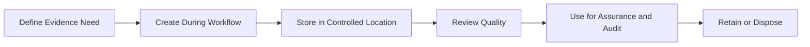

# Evidence Management Model

Evidence management ensures that proof of ISMS operation is available, reliable, and proportionate.

## Evidence lifecycle

## Evidence design rules

- Define evidence before control operation.
- Prefer system-generated records.
- Include timestamp, owner, source, and scope.
- Protect evidence from unauthorized change.
- Link evidence to risk, SoA, and control records.
- Define retention period.

## Evidence quality checklist

- Is the evidence relevant?
- Is it complete?
- Is it dated?
- Is the source clear?
- Does it show operation, not only design?
- Does it cover the full population or a justified sample?
- Is it retained in a controlled location?

## Common weak evidence

- screenshots without context
- meeting notes without decisions
- policies with no approval record
- exported reports without date or scope
- interview statements without records
- manually edited spreadsheets without review history
