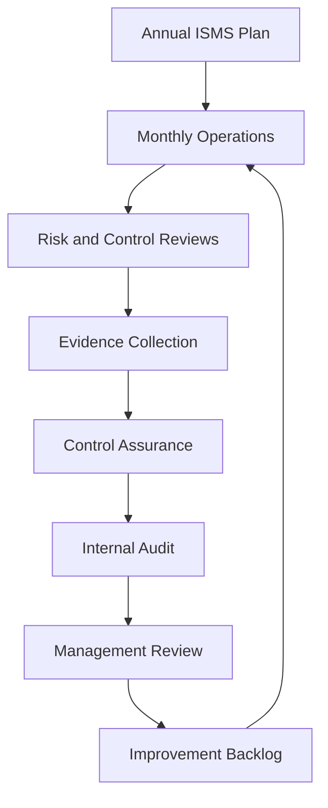

# ISMS Professional Toolkit

This section is designed for people who already understand ISO/IEC 27001 and need to operate a living, measurable, audit-ready ISMS.

## Purpose

The toolkit helps ISMS professionals answer:

- What should we do every month, quarter, and year?
- How do we know controls are working?
- How do we prepare for audits without panic?
- How do we collect useful evidence by design?
- How do we measure security culture, awareness, and control maturity?
- How do we keep management review meaningful?
- How do we make continual improvement visible?

## Core operating model

## Toolkit contents

- Annual ISMS operating calendar
- ISMS health dashboard
- Control assurance methodology
- Control owner self-assessment
- Risk owner review pack
- Management review pack
- Internal audit program
- Evidence management model
- User awareness and culture surveys
- Supplier assurance pack
- Incident tabletop scenarios
- Metrics library
- Policy and procedure starter library
