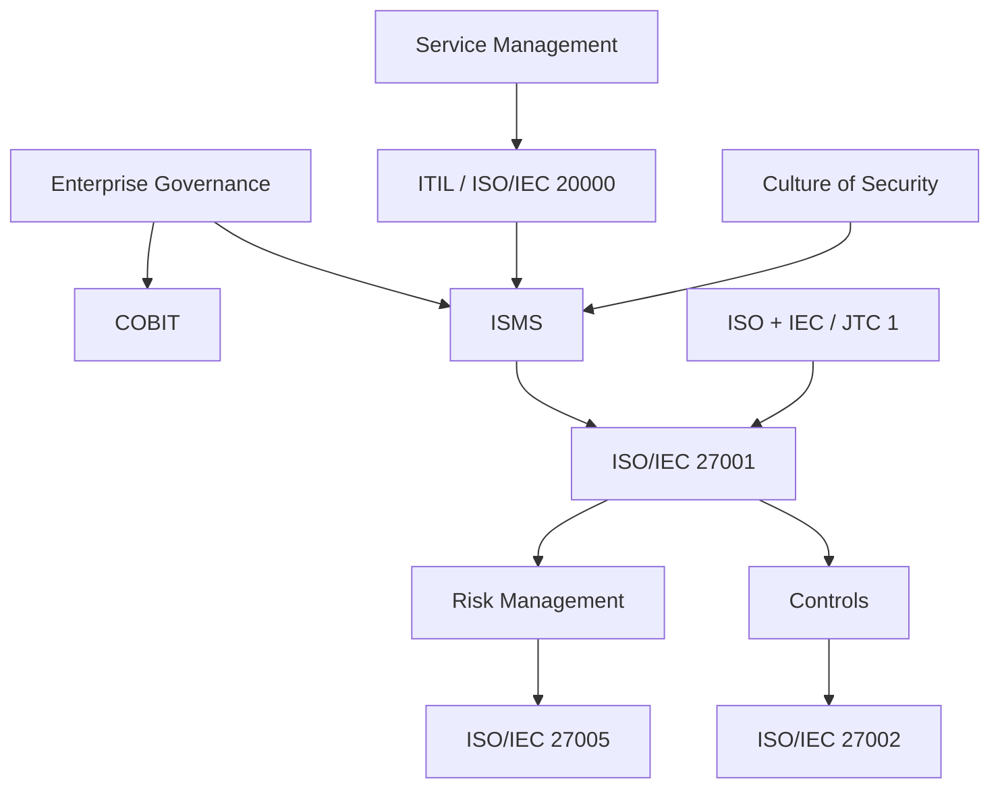

# Framework Relationship Map

Different frameworks answer different questions. A mature organization uses them together without duplicating work.

## Relationship map

| Framework / body | Primary question answered | Best use |
|---|---|---|
| ISO | What internationally agreed requirements or guidance apply? | Standards and management systems |
| IEC | What technology-related international standards apply? | Electrical, electronic, and IT-related standardization |
| ISO/IEC JTC 1 | How are IT standards developed coherently across ISO and IEC? | IT standardization context |
| ISO/IEC 27001 | What must an information security management system (ISMS) satisfy? | Certification and ISMS requirements |
| ISO/IEC 27002 | How can controls be implemented? | Control design guidance |
| ISO/IEC 27005 | How can information security risk be managed? | Risk methodology |
| ISMS | How does the organization operate security management? | Governance, risk, controls, evidence, improvement |
| ITIL | How should IT and digital services be managed? | Service management workflows |
| ISO/IEC 20000 | What should a service management system satisfy? | Formal service management |
| COBIT | How should enterprise information and technology be governed and managed? | Governance, alignment, performance |
| OECD security guidance | What cultural principles support security behavior? | Awareness, responsibility, ethics, culture |

## Integration pattern

## Avoiding duplication

- Use one risk register where possible.
- Use one evidence catalog mapped to multiple frameworks.
- Use existing ITIL workflows as ISMS evidence.
- Use COBIT governance metrics for leadership reporting.
- Use ISO/IEC 27002 to design controls selected in the SoA.

## Related integrated management systems guidance

For practical integration across ISMS, quality management system (QMS), business continuity management system (BCMS), IT Service Management (ITSM), privacy, risk, compliance, and internal control systems, see:

- [Integrated Management Systems](../24-pdf-source-integration/integrated-management-systems.md)

## Practical example

Leadership compares this perspective with the organization's legal duties, values, risk appetite, and existing management systems before deciding which practices to adopt and how to communicate them.

## Evidence to retain

Retain records showing both design decisions and actual operation, such as:

- framework-selection rationale
- stakeholder and obligation analysis
- approved governance decision
- review showing the approach remains suitable

## Related controls, clauses, templates, and checklists

Project indexes: [clauses](../03-iso27001/clauses-4-to-10.md) · [controls](../06-annex-a/index.md) · [templates](../10-templates/index.md) · [checklists](../11-checklists/index.md) · [abbreviations](../15-reference/abbreviations.md).
