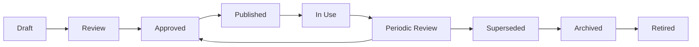

# ISMS Document Lifecycle
## Lifecycle stages

## Document metadata

Every controlled ISMS document should include:

- title
- document ID
- version
- owner
- reviewer
- approver
- approval date
- next review date
- classification
- retention period
- change history

## Review triggers

Review a document when:

- the ISMS scope changes
- the organization changes
- technology changes
- incidents reveal weakness
- internal audits identify gaps
- legal or contractual requirements change
- suppliers or critical dependencies change

## Audit evidence

Auditors may sample:

- whether documents are approved
- whether versions are controlled
- whether employees can access current documents
- whether old versions are archived
- whether review dates are followed
- whether documents match actual practice

## Related policy and document architecture

For enhanced policy hierarchy, version-control, terminology, distribution, classification, and review guidance, see:

- [Policy and Document Architecture Enhancement](../24-pdf-source-integration/policy-document-architecture.md)
- [Policy Header and Version Control Template](../10-templates/policy-header-version-control-template.md)

## Practical example

An ISMS coordinator uses this guidance to select the minimum useful document, assigns an owner and approver, and connects the controlled document to the process records that prove actual operation.

## Evidence to retain

Retain records showing both design decisions and actual operation, such as:

- document owner and approval
- version and change history
- distribution or acknowledgement record
- linked operating evidence

## Related controls, clauses, templates, and checklists

Project indexes: [clauses](../03-iso27001/clauses-4-to-10.md) · [controls](../06-annex-a/index.md) · [templates](../10-templates/index.md) · [checklists](../11-checklists/index.md) · [abbreviations](../15-reference/abbreviations.md).
