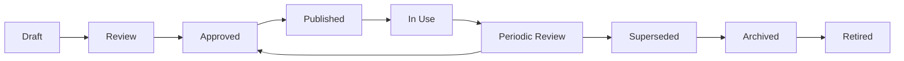

# ISMS Document Lifecycle

## Lifecycle stages

## Document metadata

Every controlled ISMS document should include:

- title
- document ID
- version
- owner
- reviewer
- approver
- approval date
- next review date
- classification
- retention period
- change history

## Review triggers

Review a document when:

- the ISMS scope changes
- the organization changes
- technology changes
- incidents reveal weakness
- internal audits identify gaps
- legal or contractual requirements change
- suppliers or critical dependencies change

## Audit evidence

Auditors may sample:

- whether documents are approved
- whether versions are controlled
- whether employees can access current documents
- whether old versions are archived
- whether review dates are followed
- whether documents match actual practice

## Related policy and document architecture

For enhanced policy hierarchy, version-control, terminology, distribution, classification, and review guidance, see:

- [Policy and Document Architecture Enhancement](../24-pdf-source-integration/policy-document-architecture.md)
- [Policy Header and Version Control Template](../10-templates/policy-header-version-control-template.md)
