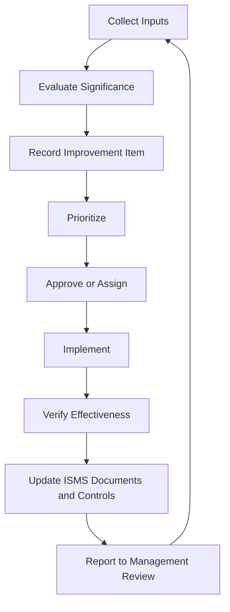

# Continual Improvement

Continual improvement is the mechanism that keeps the ISMS suitable, adequate, and effective as the organization, threat landscape, suppliers, legal obligations, technology, and business objectives change.

## Why this section exists

Earlier chapters already discuss improvement through Clause 10, internal audit, management review, metrics, incident lessons learned, and corrective action. This section connects those parts into a single lifecycle and links back to the original chapters instead of duplicating them.

## Continual improvement in one sentence

> Continual improvement turns evidence, findings, incidents, risk changes, user feedback, control testing, and management decisions into prioritized actions that make the ISMS better over time.

## Lifecycle overview

## Key related chapters

- [Clause 10 — Improvement](../03-iso27001/clause-10-improvement.md)
- [Management Review Pack](../19-isms-professional-toolkit/management-review-pack.md)
- [Internal Audit Program](../19-isms-professional-toolkit/internal-audit-program.md)
- [Control Assurance Methodology](../19-isms-professional-toolkit/control-assurance-methodology.md)
- [ISMS Health Dashboard](../19-isms-professional-toolkit/isms-health-dashboard.md)
- [Evidence Management Model](../19-isms-professional-toolkit/evidence-management-model.md)
- [Nonconformity and Corrective Action](../08-auditing/nonconformity-corrective-action.md)
- [Corrective Action Plan Template](../10-templates/corrective-action-plan-template.md)

## Related modern data security trend watch

For bringing emerging AI, post-quantum, cloud, IoT, and data security topics into continual improvement, see:

- [Data Security Trend Watch Process](../29-emerging-data-security-trends/data-security-trend-watch-process.md)
- [Emerging Trend Intake Template](../10-templates/emerging-trend-intake-template.md)
