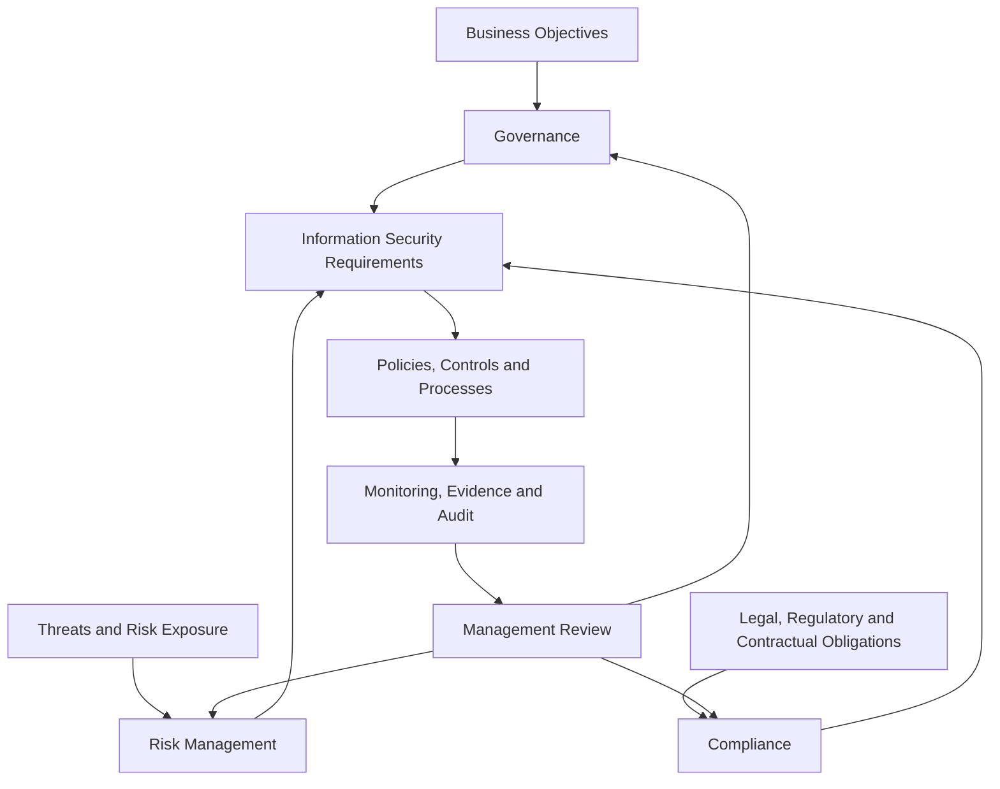

# Governance, Risk, and Compliance Operating Model

A useful way to explain the information security management system (ISMS) to management is through three viewpoints: governance, risk, and compliance.

## Governance view

Governance connects the ISMS to business objectives.

Questions:

- What business objectives must information security support?
- Who makes decisions?
- What objectives and policies apply?
- What resources are needed?
- What reports does management receive?
- What decisions must be escalated?

## Risk view

Risk management determines which controls are necessary, proportionate, and effective.

Questions:

- Which information assets and business processes are critical?
- What threats and vulnerabilities affect them?
- What is the risk appetite?
- Which controls reduce risk?
- Which residual risks are accepted?
- How are risks monitored?

## Compliance view

Compliance ensures that internal, external, legal, regulatory, contractual, and standard requirements are identified and fulfilled.

Questions:

- Which obligations apply?
- Which controls and policies address them?
- What evidence proves compliance?
- How are changes in obligations detected?
- How are nonconformities handled?

## Operating model

## Suggested GRC dashboard

| View | Metric | Example |
|---|---|---|
| Governance | objective achievement | percentage of security objectives on track |
| Governance | management decisions overdue | decisions older than threshold |
| Risk | high risks overdue for treatment | number of overdue high risks |
| Risk | control failures | failed control tests |
| Compliance | obligations reviewed | percentage reviewed on schedule |
| Compliance | audit findings overdue | open findings past due |

## Related documents

- [ISMS Health Dashboard](../19-isms-professional-toolkit/isms-health-dashboard.md)
- [Management Review Pack](../19-isms-professional-toolkit/management-review-pack.md)
- [Metrics Library](../19-isms-professional-toolkit/metrics-library.md)

## Practical example

A CISO struggling to get board attention restructures the security briefing around the three views: governance (two security objectives off track due to unfilled roles), risk (four high risks overdue for treatment, one requiring a risk-acceptance decision), and compliance (a new contractual encryption obligation not yet mapped to controls). Framing the same underlying data as decisions per view — rather than a technical status list — gets the board to approve hiring, formally accept one risk, and assign an owner for the new obligation.

## Evidence to retain

Retain records showing the three views are operated, such as:

- GRC dashboard extracts with the metrics per view
- management decisions traced to governance, risk, or compliance triggers
- obligation register updates and their mapping to controls
- management review minutes closing the feedback loop into all three views

## Related controls, clauses, templates, and checklists

Project indexes: [clauses](../03-iso27001/clauses-4-to-10.md) · [controls](../06-annex-a/index.md) · [templates](../10-templates/index.md) · [checklists](../11-checklists/index.md) · [abbreviations](../15-reference/abbreviations.md).
