# Enhanced ISMS Implementation Roadmap

The uploaded material reinforces that ISMS implementation is an organization-wide program, not just a documentation task.

## Roadmap overview

```mermaid
flowchart LR
    A[Initiate] --> B[Current-State Assessment]
    B --> C[Define Scope]
    C --> D[Identify Assets and Protection Needs]
    D --> E[Define Objectives and Policy]
    E --> F[Risk Management and SoA]
    F --> G[Plan Controls and Processes]
    G --> H[Implement Measures]
    H --> I[Operate and Evidence]
    I --> J[Monitor, Audit and Review]
    J --> K[Certification Readiness]
    K --> L[Continual Improvement]
    L --> I
```

## Phase 1 — Initiate

Key activities:

- secure management support
- define project mandate
- assign project lead and ISMS manager
- confirm resources
- define governance forum
- create implementation plan

Outputs:

- project charter
- management commitment record
- implementation workstream plan

## Phase 2 — Current-state assessment

Key activities:

- review existing policies, processes, tools, and evidence
- identify current technical and physical measures
- review competencies and resources
- inventory existing monitoring and audit processes
- conduct initial gap analysis

Outputs:

- current-state report
- gap analysis
- initial risk themes

## Phase 3 — Scope and context

Key activities:

- define ISMS boundaries
- identify internal and external issues
- identify interested parties and requirements
- identify interfaces with internal and outsourced processes
- confirm scope suitability for certification goals

Outputs:

- scope statement
- interested-party register
- interface register
- certification scope assurance record

## Phase 4 — Assets and protection needs

Key activities:

- identify information assets and supporting resources
- identify owners
- assess confidentiality, integrity, and availability needs
- identify critical services and dependencies

Outputs:

- asset inventory
- protection-needs analysis
- dependency map

## Phase 5 — Objectives and policy

Key activities:

- derive security objectives from business objectives and risks
- define policy architecture
- approve information security policy
- define communication and awareness approach

Outputs:

- security objectives register
- information security policy
- policy communication record

## Phase 6 — Risk management and SoA

Key activities:

- define risk methodology
- conduct risk assessments
- select treatment options
- select controls
- create SoA
- approve residual-risk decisions

Outputs:

- risk methodology
- risk register
- risk treatment plan
- Statement of Applicability
- risk acceptance records

## Phase 7 — Control and process design

Key activities:

- define control owners
- design operating processes
- define evidence requirements
- define KPIs, KRIs, and KCIs
- prioritize implementation actions

Outputs:

- control implementation plan
- ISMS process catalog
- evidence register
- metrics catalog

## Phase 8 — Implementation and operation

Key activities:

- implement policies, processes, and controls
- train affected users
- operate controls
- collect evidence
- manage incidents and exceptions

Outputs:

- operating evidence
- training records
- incident records
- exception register

## Phase 9 — Monitor, audit, and review

Key activities:

- perform control testing
- monitor KPIs/KRIs/KCIs
- conduct internal audits
- perform management review
- update improvement backlog

Outputs:

- dashboard
- audit reports
- management review minutes
- improvement register

## Phase 10 — Certification readiness

Key activities:

- verify scope alignment
- test evidence quality
- brief control owners
- close critical gaps
- prepare Stage 1 and Stage 2 audit evidence

Outputs:

- certification readiness report
- Stage 1 checklist
- Stage 2 checklist
- corrective action tracker

## Related documents

- [ISMS Documentation Roadmap](../22-isms-documentation-template-pack/isms-documentation-roadmap.md)
- [Continual Improvement](../23-continual-improvement/index.md)
- [Stage 1 Readiness Checklist](../11-checklists/stage-1-readiness.md)
- [Stage 2 Readiness Checklist](../11-checklists/stage-2-readiness.md)
