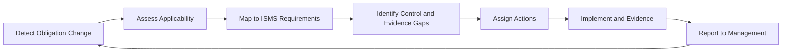

# Regulatory Readiness Operating Model

Regulatory expectations change as cyber threats, digital dependency, and critical-service risks increase. The information security management system (ISMS) should therefore include a repeatable regulatory readiness process.

## Scope of this page

This page is generic and does not provide legal advice. It is intended as an ISMS operating model for tracking obligations and converting them into controls, evidence, and management decisions.

## Regulatory readiness lifecycle

## Obligation categories

- risk management measures
- incident reporting and notification
- governance accountability
- training obligations for management or staff
- supply-chain security
- business continuity and crisis management
- backup and recovery
- access control and multifactor authentication (MFA)
- cryptography
- vulnerability handling
- evidence and audit obligations
- information sharing

## Implementation guidance

For each obligation:

1. identify applicability
2. map to ISO 27001 clause or Annex A controls
3. identify current evidence
4. assess gaps
5. assign owner
6. set deadline
7. track management decision
8. review in management review

## Related templates

- [Regulatory Obligations Assessment Template](../10-templates/regulatory-obligations-assessment-template.md)
- [Interested Parties and Requirements Register Template](../10-templates/interested-parties-register-template.md)
- [Management Review Pack Template](../10-templates/management-review-pack-template.md)

## Practical example

When a new national cybersecurity law is published, the compliance owner runs the readiness lifecycle. Qualified legal advice confirms applicability and identifies the enacted reporting and management-training duties. Those obligations are mapped to relevant ISO/IEC 27001 processes without treating the standard as proof of legal compliance. The gap assessment identifies a missing early-warning workflow and incomplete management-body training records; both gaps receive owners and deadlines, and progress is reported at management review until closure evidence is recorded.

## Evidence to retain

Retain records showing obligations are tracked to closure, such as:

- applicability assessments for new or changed obligations
- obligation-to-control mappings in the obligations register
- gap assessments with assigned owners and deadlines
- management review records covering regulatory readiness status

## Related controls, clauses, templates, and checklists

Project indexes: [clauses](../03-iso27001/clauses-4-to-10.md) · [controls](../06-annex-a/index.md) · [templates](../10-templates/index.md) · [checklists](../11-checklists/index.md) · [abbreviations](../15-reference/abbreviations.md).
