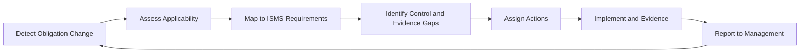

# Regulatory Readiness Operating Model

Regulatory expectations change as cyber threats, digital dependency, and critical-service risks increase. The information security management system (ISMS) should therefore include a repeatable regulatory readiness process.

## Scope of this page

This page is generic and does not provide legal advice. It is intended as an ISMS operating model for tracking obligations and converting them into controls, evidence, and management decisions.

## Regulatory readiness lifecycle

## Obligation categories

- risk management measures
- incident reporting and notification
- governance accountability
- training obligations for management or staff
- supply-chain security
- business continuity and crisis management
- backup and recovery
- access control and multifactor authentication (MFA)
- cryptography
- vulnerability handling
- evidence and audit obligations
- information sharing

## Implementation guidance

For each obligation:

1. identify applicability
2. map to ISO 27001 clause or Annex A controls
3. identify current evidence
4. assess gaps
5. assign owner
6. set deadline
7. track management decision
8. review in management review

## Related templates

- [Regulatory Obligations Assessment Template](../10-templates/regulatory-obligations-assessment-template.md)
- [Interested Parties and Requirements Register Template](../10-templates/interested-parties-register-template.md)
- [Management Review Pack Template](../10-templates/management-review-pack-template.md)

## ISO requirement, implementation guidance, and best practice

- **ISO requirement:** This chapter explains **Regulatory Readiness Operating Model** without reproducing standard text. Determine formal obligations from the applicable clauses, scope, risk treatment, Statement of Applicability, and binding legal or contractual requirements.
- **Implementation guidance:** Adapt the described roles, frequency, workflow, and evidence to the organization.
- **Best practice:** Enhancements are optional unless adopted through policy, contract, or risk treatment.

## Practical example

A program team uses this synthesis to compare external source ideas with the current ISMS, adopts only practices that address a documented need, and records the local decision rather than treating source material as a requirement.

## Evidence to retain

Retain records showing both design decisions and actual operation, such as:

- source and applicability record
- gap or comparison analysis
- approved adoption decision
- implementation and review evidence

Intent documents are insufficient on their own; retain scoped operating records, approvals, exceptions, and verified follow-up.

## Related controls, clauses, templates, and checklists

Project indexes: [clauses](../03-iso27001/clauses-4-to-10.md) · [controls](../06-annex-a/index.md) · [templates](../10-templates/index.md) · [checklists](../11-checklists/index.md) · [abbreviations](../15-reference/abbreviations.md).
