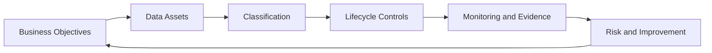

# Data Security Governance

Data security governance ensures that important data is identified, classified, protected, monitored, retained, shared, and deleted according to business value, legal obligations, risk, and ethical expectations.

The uploaded source material emphasized that data security governance is not only a technical concern. It involves the complete lifecycle of data, including collection, transmission, use, storage, and destruction, as well as policies, regulations, industrial ecosystems, identity, communication security, storage security, and operational security.

## Goals of this section

- make data the explicit protection object of the information security management system (ISMS)
- connect data security to business objectives and risk appetite
- define ownership and stewardship
- improve data classification and handling
- map data flows for risk, privacy, and breach readiness
- define lifecycle controls
- create evidence for audit, management review, and customer assurance

## Core model

## ISO/IEC 27001 relationship

This topic supports the ISMS by strengthening risk-based implementation of relevant clauses and Annex A controls. Typical relationships include:

- Clause 4 — context, interested parties, and scope
- Clause 6 — risk assessment, risk treatment, and objectives
- Clause 7 — competence, awareness, communication, and documented information
- Clause 8 — operational planning and control
- Clause 9 — monitoring, measurement, audit, and management review
- Clause 10 — corrective action and continual improvement

Relevant Annex A controls are referenced in the implementation and evidence sections of each page.

## Related project documents

- [Related Document Map](../15-reference/related-document-map.md)
- [Statement of Applicability Template](../10-templates/statement-of-applicability-template.md)
- [Risk Register Template](../10-templates/risk-register-template.md)
- [Evidence Register Template](../10-templates/evidence-register-template.md)
- [Continual Improvement](../23-continual-improvement/index.md)

## How to use this section

Start with the overview of **Data Security Governance**, then follow the linked articles according to the decision or task at hand. Use the related templates to record decisions and the checklists to verify completion. Each linked article distinguishes formal ISO requirements from implementation guidance and optional best practice.

## Related controls, clauses, templates, and checklists

Project indexes: [clauses](../03-iso27001/clauses-4-to-10.md) · [controls](../06-annex-a/index.md) · [templates](../10-templates/index.md) · [checklists](../11-checklists/index.md) · [abbreviations](../15-reference/abbreviations.md).
