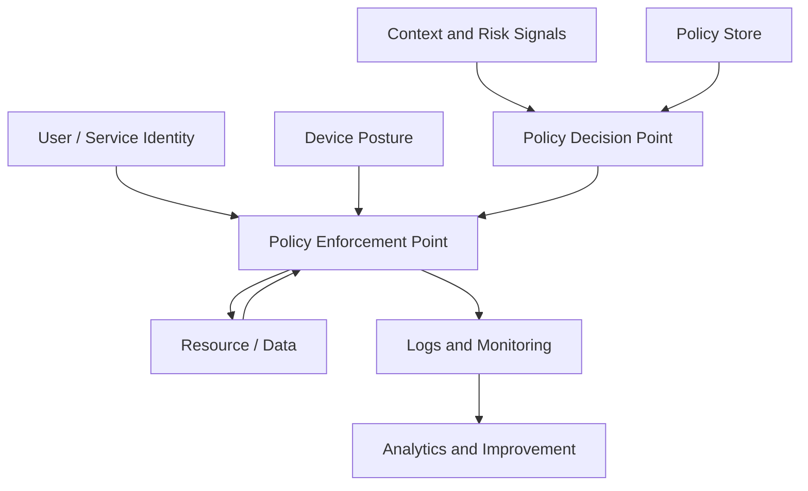

# Zero Trust Reference Architecture

## Logical components

## Control domains

| Domain | Example controls |
|---|---|
| identity | MFA, identity governance, conditional access |
| device | endpoint compliance, EDR, patch posture |
| network | segmentation, encrypted transport, ZTNA |
| application | access proxy, API authorization |
| data | classification, DLP, masking, encryption |
| monitoring | SIEM, UEBA, alert triage, control metrics |
| governance | roadmap, risk register, exceptions |

## Typical evidence

- approved policy, standard, procedure, or architecture record
- risk assessment or design review
- owner and role assignment
- implementation plan
- operating records
- monitoring records
- exception or waiver decisions
- test results
- audit records
- management review decisions

## Related project documents

- [Related Document Map](../15-reference/related-document-map.md)
- [Statement of Applicability Template](../10-templates/statement-of-applicability-template.md)
- [Risk Register Template](../10-templates/risk-register-template.md)
- [Evidence Register Template](../10-templates/evidence-register-template.md)
- [Continual Improvement](../23-continual-improvement/index.md)
