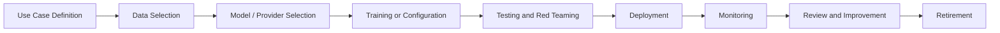

# Secure artificial intelligence (AI) Development Lifecycle

## Lifecycle

## Control points

- use-case approval
- data minimization
- data lineage
- model/provider risk review
- security and privacy testing
- output validation
- prompt injection testing
- access control
- monitoring
- incident response
- retirement and deletion

## Typical evidence

- approved policy, standard, procedure, or architecture record
- risk assessment or design review
- owner and role assignment
- implementation plan
- operating records
- monitoring records
- exception or waiver decisions
- test results
- audit records
- management review decisions

## Related project documents

- [Related Document Map](../15-reference/related-document-map.md)
- [Statement of Applicability Template](../10-templates/statement-of-applicability-template.md)
- [Risk Register Template](../10-templates/risk-register-template.md)
- [Evidence Register Template](../10-templates/evidence-register-template.md)
- [Continual Improvement](../23-continual-improvement/index.md)

## Practical example

A technology-risk forum evaluates this topic before adoption, separates demonstrated risk from speculation, runs a limited assessment, and records monitoring triggers for revisiting the decision.

## Related controls, clauses, templates, and checklists

Project indexes: [clauses](../03-iso27001/clauses-4-to-10.md) · [controls](../06-annex-a/index.md) · [templates](../10-templates/index.md) · [checklists](../11-checklists/index.md) · [abbreviations](../15-reference/abbreviations.md).
