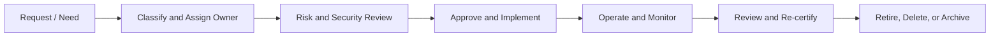

# Asset, Data, and Service Lifecycle

Security teams often maintain inventories, but lifecycle management goes further. It asks what happens before an item appears in the inventory and what happens after it is no longer used.

## Example: customer dataset

A customer dataset is created for analytics. The data owner classifies it as confidential. The ISMS team identifies risks such as unauthorized export, secondary use, re-identification, and over-retention. Controls include restricted access, approved purpose, data minimization, export logging, retention rules, and deletion evidence.

## Best practices

- Do not separate data ownership from system ownership without defining how the roles cooperate.
- Classify data before selecting storage and access controls.
- Link critical services to recovery objectives and supplier dependencies.
- Require retirement records for systems, datasets, accounts, certificates, keys, and suppliers.
- Include shadow data, exports, logs, caches, and backups in lifecycle thinking.

## Related chapters

- [Data Security Lifecycle](../25-data-security-governance/data-security-lifecycle.md)
- [Data Flow Mapping](../25-data-security-governance/data-flow-mapping.md)
- [Asset Inventory Template](../10-templates/asset-inventory-template.md)
- [Data Asset Register Template](../10-templates/data-asset-register-template.md)
