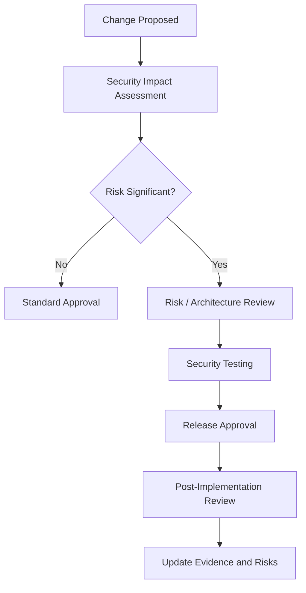

# Change and Release Security Lifecycle

Change is one of the most important security lifecycle triggers. A well-controlled change process prevents security drift and ensures that risks are reassessed before systems move into production.

## Example

A development team adds a new API endpoint that exposes customer data to a partner. Security review should check data classification, authentication, authorization, rate limiting, logging, monitoring, supplier obligations, breach impact, DLP/export control, testing, and rollback.

## Best practices

- Use lightweight review for low-risk changes and deeper review for high-risk changes.
- Make security requirements part of the change form.
- Integrate security testing into CI/CD where possible.
- Require risk updates when changes affect sensitive data or critical services.
- Keep release evidence linked to the asset and service records.
- Use post-implementation review for failed or emergency changes.

## Related chapters

- [DevSecOps Guide](../16-implementation-guides/devsecops-guide.md)
- [Change Security Assessment Template](../10-templates/change-security-assessment-template.md)
- [A.8.32 Change Management](../06-annex-a/technological/a8-32-change-management.md)
