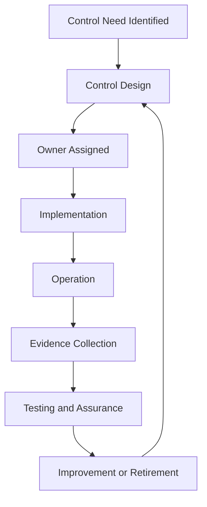

# Control Lifecycle Overview

A control should be managed like a living capability. It is not enough to state that a control exists; the organization must know why it exists, who owns it, how it operates, whether it works, and when it should change.

## Example: quarterly access review

A risk assessment identifies excessive access to a customer database. The control requires quarterly review by the data owner, coverage of all active users, documented decisions, and tracked removal actions. Evidence includes identity and access management (IAM) export, reviewer decision record, removal tickets, and completion report. Internal audit later samples two quarters and verifies population completeness and remediation.

## Best practices

- Define the risk or requirement the control addresses.
- Assign an accountable control owner and operating team.
- Define population completeness.
- Define evidence before the first control run.
- Test operating effectiveness, not only policy existence.
- Track exceptions and control failures.
- Use metrics to determine whether the control still works.

## Related chapters

- [Control Lifecycle Management](../04-isms/control-lifecycle.md)
- [Control Assurance Methodology](../19-isms-professional-toolkit/control-assurance-methodology.md)
- [Control Attestation Template](../10-templates/control-attestation-template.md)

## Practical example

A process owner applies this lifecycle to a scoped service from initiation through change and retirement, defines decision gates and evidence at each stage, and reviews exceptions before closure.

## Evidence to retain

Retain records showing both design decisions and actual operation, such as:

- lifecycle record with owner and scope
- stage approvals and operating records
- exceptions and remediation actions
- closure and retained-evidence record

Intent documents are insufficient on their own; retain scoped operating records, approvals, exceptions, and verified follow-up.

## Related controls, clauses, templates, and checklists

Project indexes: [clauses](../03-iso27001/clauses-4-to-10.md) · [controls](../06-annex-a/index.md) · [templates](../10-templates/index.md) · [checklists](../11-checklists/index.md) · [abbreviations](../15-reference/abbreviations.md).
