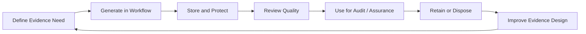

# Evidence and Assurance Lifecycle

Evidence proves that the information security management system (ISMS) and controls operate. Evidence should be designed into workflows instead of collected in panic before an audit.

## Example

For vulnerability management, evidence may include scanner coverage report, vulnerability ticket, risk acceptance record, patch change ticket, rescan result, dashboard trend, and management escalation for overdue critical findings.

## Best practices

- Define evidence source, owner, frequency, and retention.
- Prefer system-generated records over manual screenshots.
- Use evidence once and map it to multiple requirements.
- Protect evidence according to sensitivity.
- Review evidence quality before external audits.
- Archive old evidence according to retention rules.
- Feed weak evidence findings into continual improvement.

## Related chapters

- [Evidence Management Model](../19-isms-professional-toolkit/evidence-management-model.md)
- [Audit Evidence](../08-auditing/audit-evidence.md)
- [Evidence Register Template](../10-templates/evidence-register-template.md)

## Evidence to retain

Retain records showing both design decisions and actual operation, such as:

- evidence register defining source, owner, frequency, and retention per control
- system-generated operating records collected in workflow
- evidence quality review results before audits
- archival and disposal records aligned with retention rules

## Related controls, clauses, templates, and checklists

Project indexes: [clauses](../03-iso27001/clauses-4-to-10.md) · [controls](../06-annex-a/index.md) · [templates](../10-templates/index.md) · [checklists](../11-checklists/index.md) · [abbreviations](../15-reference/abbreviations.md).
