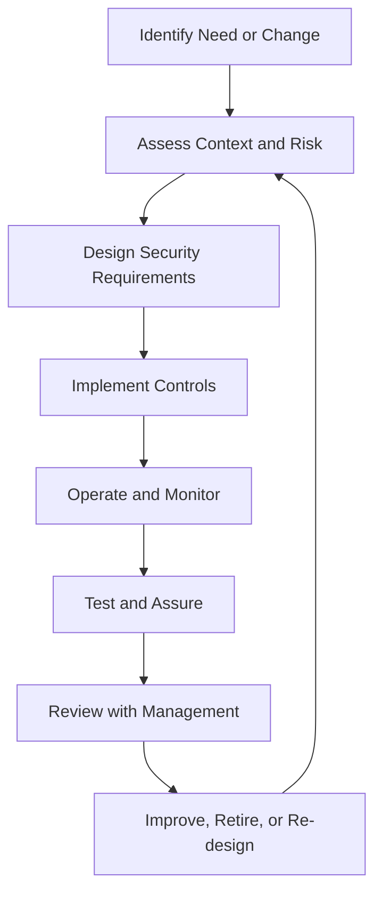

# Security Lifecycle Management

Security lifecycle management explains how security capabilities are introduced, operated, measured, improved, and retired. It connects many parts of the knowledge base that were previously spread across separate chapters.

The key idea is simple: security is not a one-time design decision. Every security object has a lifecycle. Assets are created and retired. Identities join, move, and leave. Controls are designed, operated, tested, and improved. Risks change. Suppliers are onboarded and offboarded. Incidents produce lessons learned. Evidence is collected, reviewed, and eventually archived.

## Security lifecycle overview

## Practical example

A new SaaS platform is introduced for customer support. The ISMS team assesses the data, supplier, privacy, access, logging, and breach-notification risks. The platform is configured with SSO, MFA, role-based access, export logging, retention rules, and supplier-review evidence. During operation, access reviews, incidents, supplier changes, and data exports are monitored. Lessons learned update the risk register, SoA, SaaS onboarding checklist, and future security requirements.

## Best practices

- Define lifecycle owners, not just document owners.
- Design evidence collection before the control goes live.
- Use existing ITSM workflows where possible.
- Link lifecycle decisions to risks and SoA controls.
- Include retirement and decommissioning; security does not end at implementation.
- Feed lifecycle lessons into the improvement backlog.

## Related detailed chapters

- [ISMS Operating Model](../04-isms/isms-operating-model.md)
- [Control Lifecycle Management](../04-isms/control-lifecycle.md)
- [Risk Management](../05-risk-management/index.md)
- [Continual Improvement](../23-continual-improvement/index.md)
- [Evidence Management Model](../19-isms-professional-toolkit/evidence-management-model.md)
- [Data Security Governance](../25-data-security-governance/index.md)
- [Incident and Data Breach Management](../28-incident-and-data-breach-management/index.md)
- [IT Governance and ITSM](../32-it-governance-and-itsm/index.md)
