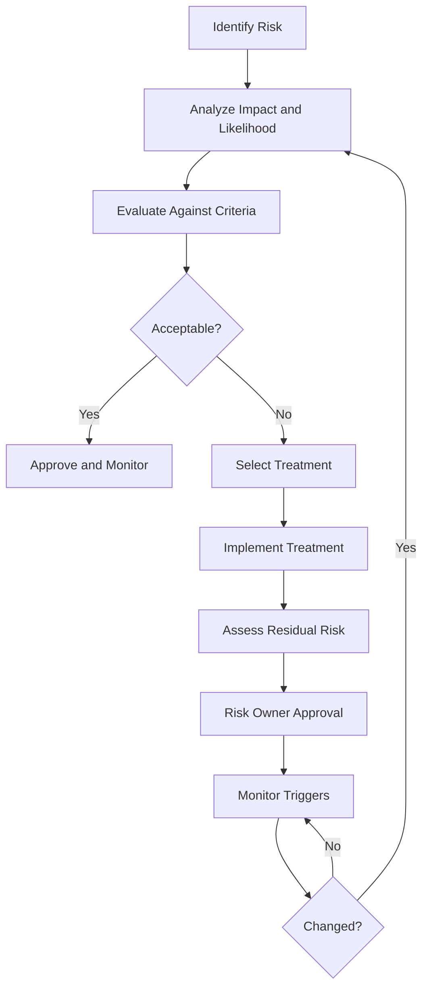

# Risk Lifecycle

A risk register is not a static spreadsheet. Risks have lifecycles.

## Example

A risk is identified: unauthorized access to a data warehouse due to broad analyst permissions. Treatment actions include role redesign, quarterly access reviews, and export alerts. Residual risk is accepted by the data owner after controls are implemented. Monitoring includes access review completion, export volume, and privileged access exceptions.

## Best practices

- Write risks as scenarios, not vague topics.
- Assign business risk owners.
- Link each risk to affected assets and controls.
- Use treatment actions with owners and dates.
- Do not let accepted risks expire silently.
- Reassess after incidents, major changes, or new obligations.

## Related chapters

- [Risk Methodology](../05-risk-management/risk-methodology.md)
- [Risk Register](../05-risk-management/risk-register.md)
- [Risk Treatment](../05-risk-management/risk-treatment.md)
- [Data Security Risk Scenarios](../25-data-security-governance/data-security-risk-scenarios.md)

## Evidence to retain

Retain records showing both design decisions and actual operation, such as:

- lifecycle record with owner and scope
- stage approvals and operating records
- exceptions and remediation actions
- closure and retained-evidence record

Intent documents are insufficient on their own; retain scoped operating records, approvals, exceptions, and verified follow-up.

## Related controls, clauses, templates, and checklists

Project indexes: [clauses](../03-iso27001/clauses-4-to-10.md) · [controls](../06-annex-a/index.md) · [templates](../10-templates/index.md) · [checklists](../11-checklists/index.md) · [abbreviations](../15-reference/abbreviations.md).
