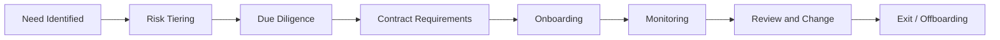

# Supplier Security Lifecycle

Supplier security is a lifecycle because supplier risk changes over time.

## Example

A software as a service (SaaS) vendor is selected to process customer support tickets. The supplier is classified as high risk because it processes customer data. Due diligence reviews security certifications, incident notification, encryption, access, subprocessors, and business continuity. At exit, data return and deletion are verified.

## Best practices

- Tier suppliers by data sensitivity and service criticality.
- Involve procurement, legal, privacy, security, and business owners.
- Define contract security requirements before signature.
- Track subprocessors and fourth-party dependencies.
- Monitor incidents, material changes, and certification status.
- Plan exit before onboarding.
- Keep supplier evidence linked to the risk register and SoA.

## Related chapters

- [Supplier Assurance Pack](../19-isms-professional-toolkit/supplier-assurance-pack.md)
- [Supplier Security Assessment Template](../10-templates/supplier-security-assessment-template.md)
- [ISO/IEC 27036 Supplier Relationship Security](../03-iso27001/iso27036-supplier-security.md)

## Evidence to retain

Retain records showing both design decisions and actual operation, such as:

- risk tiering and due diligence records per supplier
- contract security requirements agreed before signature
- monitoring records covering incidents, subprocessors, and certification status
- exit records verifying data return and deletion

## Related controls, clauses, templates, and checklists

Project indexes: [clauses](../03-iso27001/clauses-4-to-10.md) · [controls](../06-annex-a/index.md) · [templates](../10-templates/index.md) · [checklists](../11-checklists/index.md) · [abbreviations](../15-reference/abbreviations.md).
