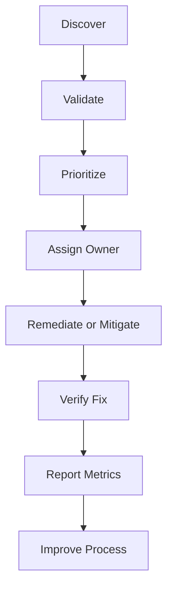

# Vulnerability Lifecycle

Vulnerability management is not just scanning. It is a lifecycle that connects asset inventory, threat intelligence, ownership, change management, exceptions, and verification.

## Example

A critical vulnerability affects an internet-facing application. The scanner detects it, the application owner confirms exposure, and remediation is scheduled through change management. The fix is verified by rescanning. If the patch is delayed, risk acceptance and compensating controls are required.

## Best practices

- Reconcile scanner coverage with the asset inventory.
- Prioritize using exploitability, exposure, criticality, and compensating controls.
- Define remediation targets by risk level.
- Use change management to reduce outage risk.
- Verify fixes rather than trusting ticket closure.
- Track exceptions with expiry dates.
- Report overdue critical vulnerabilities to management.

## Risk-based prioritization

A Common Vulnerabilities and Exposures (CVE) identifier names a publicly disclosed vulnerability; it does not establish local risk. Common Vulnerability Scoring System (CVSS) v4.0 metrics describe technical severity and environment-specific factors. The Exploit Prediction Scoring System (EPSS) estimates exploitation probability for its stated horizon. The CISA Known Exploited Vulnerabilities (KEV) catalog records evidence of exploitation. These inputs answer different questions.

Prioritize using the affected asset and owner, business or safety impact, exposure and reachable attack path, known exploitation and threat intelligence, technical severity, vulnerable configuration certainty, available mitigation, change risk, compensating controls, and applicable deadlines. Define service targets by local risk rather than scanner label alone.

An exception needs an accountable risk owner, rationale, compensating controls, expiry, review trigger, and residual-risk decision. Verify remediation by rescan or equivalent test and reconcile scanner coverage against the asset inventory.

## Common mistakes

- treating every CVE with the same score as the same business risk
- using EPSS as severity or KEV absence as evidence that exploitation is impossible
- counting closed tickets without verifying every affected instance
- excluding unsupported or intermittently connected assets from reporting
- granting permanent exceptions without expiry or tested compensating controls

## Related chapters

- [Vulnerability Management Checklist](../11-checklists/vulnerability-management.md)
- [Vulnerability Management Record Template](../10-templates/vulnerability-management-record-template.md)
- [A.8.8 Management of Technical Vulnerabilities](../06-annex-a/technological/a8-08-management-of-technical-vulnerabilities.md)
- [Software Supply Chain Security](../34-secure-by-design/software-supply-chain-security.md)

## Evidence to retain

Retain records showing both design decisions and actual operation, such as:

- scanner coverage reconciled against the asset inventory
- prioritization decisions and remediation tickets with owners
- rescan or verification results confirming fixes
- time-bound exceptions with compensating controls and management reporting

## Related controls, clauses, templates, and checklists

Project indexes: [clauses](../03-iso27001/clauses-4-to-10.md) · [controls](../06-annex-a/index.md) · [templates](../10-templates/index.md) · [checklists](../11-checklists/index.md) · [abbreviations](../15-reference/abbreviations.md).

## Sources

- [CVE Program](https://www.cve.org/)
- [FIRST CVSS v4.0](https://www.first.org/cvss/v4.0/)
- [FIRST EPSS](https://www.first.org/epss/)
- [CISA Known Exploited Vulnerabilities Catalog](https://www.cisa.gov/known-exploited-vulnerabilities-catalog)
- [NIST SP 800-40 Rev. 4](https://csrc.nist.gov/pubs/sp/800/40/r4/final)
