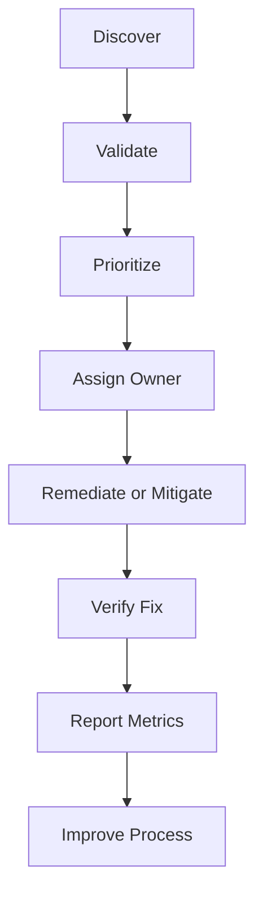

# Vulnerability Lifecycle

Vulnerability management is not just scanning. It is a lifecycle that connects asset inventory, threat intelligence, ownership, change management, exceptions, and verification.

## Example

A critical vulnerability affects an internet-facing application. The scanner detects it, the application owner confirms exposure, and remediation is scheduled through change management. The fix is verified by rescanning. If the patch is delayed, risk acceptance and compensating controls are required.

## Best practices

- Reconcile scanner coverage with the asset inventory.
- Prioritize using exploitability, exposure, criticality, and compensating controls.
- Define remediation targets by risk level.
- Use change management to reduce outage risk.
- Verify fixes rather than trusting ticket closure.
- Track exceptions with expiry dates.
- Report overdue critical vulnerabilities to management.

## Related chapters

- [Vulnerability Management Checklist](../11-checklists/vulnerability-management.md)
- [Vulnerability Management Record Template](../10-templates/vulnerability-management-record-template.md)
- [A.8.8 Management of Technical Vulnerabilities](../06-annex-a/technological/a8-08-management-of-technical-vulnerabilities.md)
