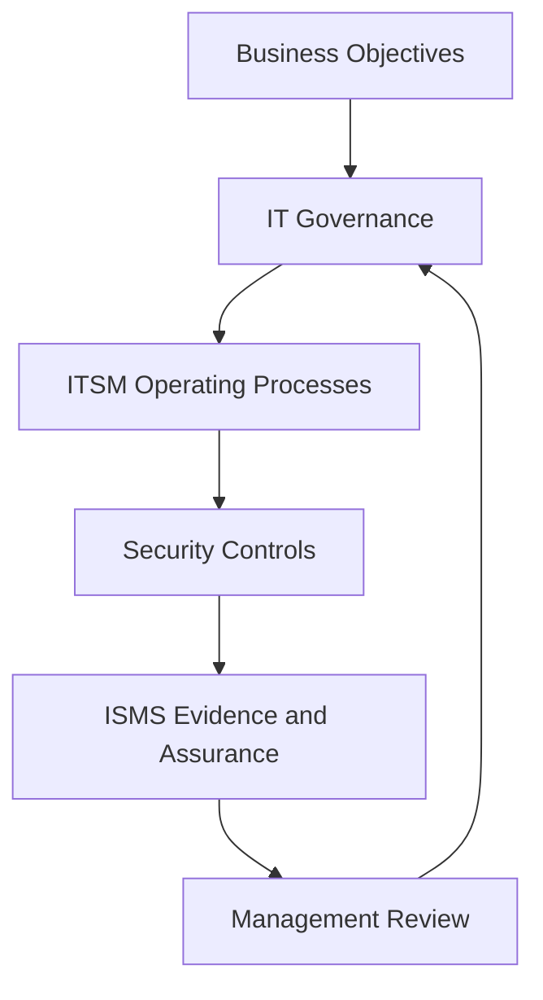

# IT Governance and information technology service management (ITSM)

IT governance and IT service management are essential to a practical information security management system (ISMS). ISO/IEC 27001 defines the management system for information security, but many security controls are operated through IT governance and ITSM processes such as incident management, change enablement, configuration management, service continuity, supplier management, request fulfillment, and service reporting.

## Why this chapter was added

The existing project included references to ITIL, ISO/IEC 20000, and COBIT. What was missing was a practical explanation of **how IT governance and ITSM support the ISMS day to day**.

## Working distinction

| Concept | Main question |
|---|---|
| IT governance | Are IT and digital services directed, controlled, and monitored to support business objectives and risk appetite? |
| ITSM | Are IT services designed, delivered, supported, and improved in a reliable and controlled way? |
| ISMS | Are information security risks managed through a suitable, adequate, and effective management system? |

## How they connect

## Example

A production change is managed through ITSM change enablement. The ISMS uses that same change record as evidence for operational control, secure development, security testing, approval, rollback planning, and auditability. One workflow supports both service reliability and security assurance.

## Related chapters

- [ITIL, ISO/IEC 20000 and ISMS](../21-ethics-and-framework-relationships/itil-iso20000-and-isms.md)
- [COBIT and ISMS](../21-ethics-and-framework-relationships/cobit-and-isms.md)
- [Framework Relationship Map](../21-ethics-and-framework-relationships/framework-relationship-map.md)
- [ISMS Process Architecture](../24-pdf-source-integration/isms-process-architecture.md)

## How to use this section

Start with the overview of **IT Governance and ITSM**, then follow the linked articles according to the decision or task at hand. Use the related templates to record decisions and the checklists to verify completion. Each linked article distinguishes formal ISO requirements from implementation guidance and optional best practice.

## Related controls, clauses, templates, and checklists

Project indexes: [clauses](../03-iso27001/clauses-4-to-10.md) · [controls](../06-annex-a/index.md) · [templates](../10-templates/index.md) · [checklists](../11-checklists/index.md) · [abbreviations](../15-reference/abbreviations.md).
