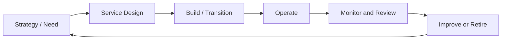

# IT Service Lifecycle and ISMS
Every IT service has a lifecycle, and the ISMS should influence each stage.

## Security by lifecycle stage

### Strategy / need

Identify business objective, expected data, interested-party requirements, and risk appetite.

### Design

Review architecture, privacy, suppliers, recovery objectives, logging, monitoring, and access model.

### Build / transition

Implement secure configuration, security testing, change approval, user training, and evidence setup.

### Operate

Operate incident management, access management, vulnerability management, monitoring, backup, and supplier review.

### Improve or retire

Perform lessons learned, risk reassessment, decommissioning, data deletion, and evidence retention.

## Best practices

- Make security requirements part of service design packages.
- Define logging and access controls before production.
- Include security acceptance criteria in release readiness.
- Review services after incidents or significant changes.

## Practical example

A company plans a new customer portal (strategy: identify data and risk appetite). During design, the security architect reviews authentication, encryption, logging, and supplier dependencies. During transition, security testing validates the design and access controls are configured. In operation, incident management, access reviews, and vulnerability scanning run continuously. After a major incident, the improvement stage triggers lessons learned, risk reassessment, and policy updates.

## Evidence to retain

Retain records showing both design decisions and actual operation, such as:

- service or configuration record
- risk, approval, and segregation-of-duties evidence
- test and implementation logs
- post-implementation review and follow-up actions

## Related controls, clauses, templates, and checklists

Project indexes: [clauses](../03-iso27001/clauses-4-to-10.md) · [controls](../06-annex-a/index.md) · [templates](../10-templates/index.md) · [checklists](../11-checklists/index.md) · [abbreviations](../15-reference/abbreviations.md).
