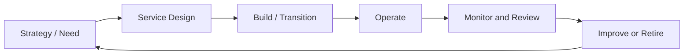

# IT Service Lifecycle and ISMS

Every IT service has a lifecycle, and the ISMS should influence each stage.

## Security by lifecycle stage

### Strategy / need

Identify business objective, expected data, interested-party requirements, and risk appetite.

### Design

Review architecture, privacy, suppliers, recovery objectives, logging, monitoring, and access model.

### Build / transition

Implement secure configuration, security testing, change approval, user training, and evidence setup.

### Operate

Operate incident management, access management, vulnerability management, monitoring, backup, and supplier review.

### Improve or retire

Perform lessons learned, risk reassessment, decommissioning, data deletion, and evidence retention.

## Best practices

- Make security requirements part of service design packages.
- Define logging and access controls before production.
- Include security acceptance criteria in release readiness.
- Review services after incidents or significant changes.
